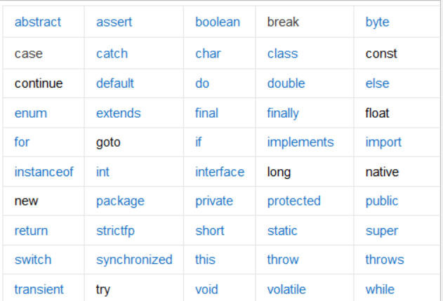
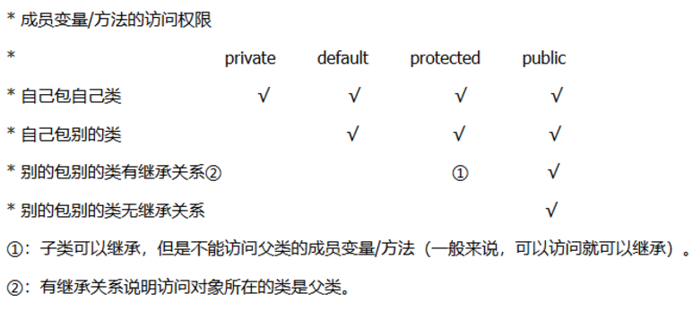

https://blog.csdn.net/ZytheMoon/article/details/78648288

一、Java关键字
Java关键字是电脑语言里事先定义的，有特别意义的标识符，有时又叫保留字，还有特别意义的变量。Java的关键字对Java的编译器有特殊的意
义，他们用来表示一种数据类型，或者表示程序的结构等，关键字不能用作变量名、方法名、类名、包名和参数。
1、保留字（reserved words）：是语言已经定义过的字，一些保留字可能没有相对应的语法，考虑到扩展性，为了向后兼容不能再将其作为变
量名。const和goto是java的保留字。 所有的关键字都是小写 。
2、关键字（keywards）：在语言中有特殊的含义成为语法的一部分。

二、关键字分类
访问控制、类控制、类方法和变量修饰符、程序控制语句、错误处理、包相关、基本类型、变量引用。
1、访问控制修饰符：private、protected、public、default
 
